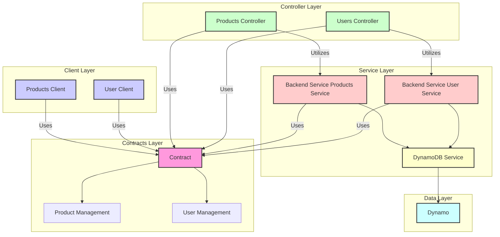

  <picture>
    <source media="(prefers-color-scheme: dark)" srcset="https://raw.githubusercontent.com/nrwl/nx/master/images/nx-dark.svg">
    
  </picture>

# Smart, Fast and Extensible Build System

Nx is a next generation build system with first class monorepo support and powerful integrations.

A few links to help you get started:

- [Nx.Dev: Documentation, Guides, Interactive Tutorials](https://nx.dev)
- [Nx.Dev: Core Tutorials](https://nx.dev/getting-started/intro)
- [Recipe: Adding Nx to an Existing Monorepo](https://nx.dev/recipes/adopting-nx/adding-to-monorepo)
- [Official Nx YouTube Channel](https://www.youtube.com/@NxDevtools)
- [Blog Posts About Nx](https://blog.nrwl.io/nx/home)

### Libraries

This project uses a variety of technologies and libraries to provide a robust and scalable application. Here's a brief overview:

- **NestJS**: A progressive Node.js framework for building efficient, reliable and scalable server-side applications.
- **React**: A JavaScript library for building user interfaces.
- **DynamoDB**: A NoSQL database service that provides fast and predictable performance with seamless scalability.
- **AWS SDK**: The AWS SDK for JavaScript provides a JavaScript API for AWS services.
- **Zod**: A TypeScript-first schema declaration and validation library.
- **React Query**: A data synchronization library for React.
- **Axios**: A promise-based HTTP client for the browser and Node.js.
- **Class Transformer**: A library that helps to create a correct TypeScript models with classes and decorators.
- **Class Validator**: A validation library for TypeScript that uses decorators.
- **RxJS**: A library for reactive programming using Observables, to make it easier to compose asynchronous or callback-based code.

### Code Structure

The flowchart describes the architecture of an application structured into multiple layers, including Contracts, Client, Controller, Service, and Data layers. Here's a detailed breakdown:

**Contracts Layer:**
- Contract: This is the source of truth for the entire application, providing the core contracts or interfaces that the rest of the system adheres to.
- Product Management: A subset of the Contract dealing specifically with products.
- User Management: Another subset of the Contract that deals specifically with users.

**Client Layer:**
- Products Client: Utilizes the "Contract" as the reference for interacting with product data.
- User Client: Similarly, it uses the "Contract" as the basis for dealing with user data.

**Controller Layer:**
- Products Controller: This is responsible for handling product-related requests. It also uses the "Contract" as a standard.
- Users Controller: Manages user-related operations and, like the Products Controller, adheres to the "Contract."

**Service Layer:**
- Backend Service Products Service: A service that does the actual business logic for product management. It interacts with a DynamoDB service for data storage and retrieval. It also aligns with the "Contract."
- Backend Service User Service: Responsible for user management and also interacts with the DynamoDB service. It too uses the "Contract" as a guide.

**Data Layer:**
- DynamoDb Service: This service is responsible for all interactions with the database.
- Dynamo: Represents the actual DynamoDB client used for database operations.

**Additional Notes:**
- The Controllers use the Backend Services for executing business logic.
- The architecture is designed in such a way that each layer has a specific role and responsibility, contributing to a modular, maintainable, and scalable system. It heavily relies on contracts as the source of truth, ensuring uniformity and coherence throughout the application.
