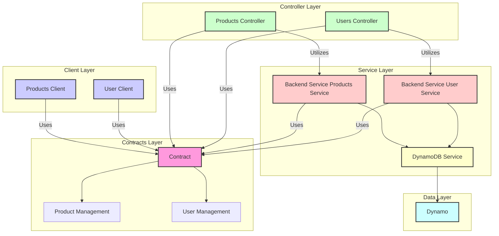

### Code Structure

The flowchart describes the architecture of an application structured into multiple layers, including Contracts, Client, Controller, Service, and Data layers. Here's a detailed breakdown:

Contracts Layer:
- Contract: This is the source of truth for the entire application, providing the core contracts or interfaces that the rest of the system adheres to.
- Product Management: A subset of the Contract dealing specifically with products.
- User Management: Another subset of the Contract that deals specifically with users.

Client Layer:
- Products Client: Utilizes the "Contract" as the reference for interacting with product data.
- User Client: Similarly, it uses the "Contract" as the basis for dealing with user data.

Controller Layer:
- Products Controller: This is responsible for handling product-related requests. It also uses the "Contract" as a standard.
- Users Controller: Manages user-related operations and, like the Products Controller, adheres to the "Contract."

Service Layer:
- Backend Service Products Service: A service that does the actual business logic for product management. It interacts with a DynamoDB service for data storage and retrieval. It also aligns with the "Contract."
- Backend Service User Service: Responsible for user management and also interacts with the DynamoDB service. It too uses the "Contract" as a guide.

Data Layer:
- DynamoDb Service: This service is responsible for all interactions with the database.
- Dynamo: Represents the actual DynamoDB client used for database operations.

Additional Notes:
- The Controllers use the Backend Services for executing business logic.
- The architecture is designed in such a way that each layer has a specific role and responsibility, contributing to a modular, maintainable, and scalable system. It heavily relies on contracts as the source of truth, ensuring uniformity and coherence throughout the application.
